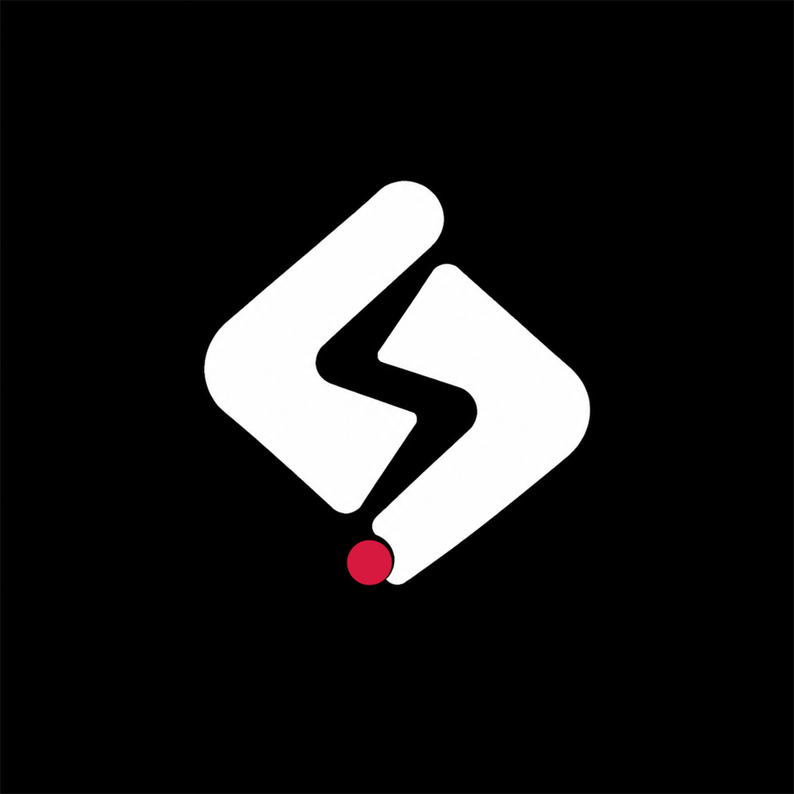

  
  <h1>NullSign</h1>
  
An on-device IPA signer with a small footprint and no certificate uploads.

NullSign is for people who already have an Apple developer certificate and want a simple way to use it on their own device. Import an IPA, choose a saved certificate, sign it, and install it without sending the app or your credentials to a signing website.

The interface is deliberately small: **Signer** handles local IPA files, **Apps** browses AltStore-compatible repositories, and **Settings** holds certificates and installation options.

## What it does

- Imports IPA files from Files or a URL
- Signs apps directly on the device
- Saves multiple `.p12` and `.mobileprovision` pairs
- Lets you name, inspect, select, check, and remove saved certificates
- Browses apps from repositories you add
- Imports optional `.deb` and `.dylib` tweaks, with ElleKit support when needed
- Uses a true OLED-black monochrome interface

## Installing NullSign

The IPA produced by this repository is unsigned. That is intentional: the public build never needs access to anyone's certificate.

1. Open the **Actions** tab and select **Build NullSign IPA**.
2. Run the workflow from the `main` branch.
3. Download the `NullSign-unsigned-IPA` artifact when the build finishes.
4. Sign that first IPA with a signer you already use, then install it on your phone.
5. In NullSign, open **Settings → Import & Manage Certificates** and add your `.p12`, password, and matching `.mobileprovision` file.

That first sign is the bootstrap step. Once NullSign is installed, it can handle the IPAs you import afterward.

## Building from source

The included GitHub Actions workflow builds on a hosted Mac, so you do not need to own one. It checks out the submodules, builds the iPhone target with Xcode, packages the app as `NullSign-unsigned.ipa`, and stores it as a workflow artifact.

No repository secrets are required for the unsigned build.

## A note about certificates

Use certificates and provisioning profiles that belong to you or that you are authorized to use. Your profile must support the device and app you are trying to install. NullSign cannot repair an expired or revoked certificate.

## Credits

NullSign is based on [Feather](https://github.com/claration/Feather), including its on-device signing and installation work. It also relies on [Zsign](https://github.com/zhlynn/zsign) for code signing. The people behind those projects did the difficult groundwork that makes this app possible.

## License

NullSign is free software under the [GNU General Public License v3.0](LICENSE). Because it is derived from Feather, redistributed versions must keep the same license and make their corresponding source available.
